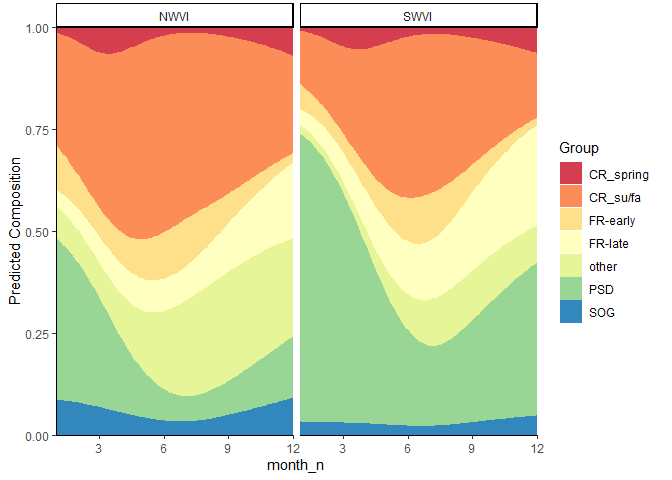
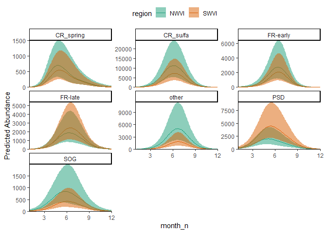

<!-- README.md is generated from README.Rmd. Please edit that file -->
  
  # stockseasonr <a href='https://github.com/pbs-assess/stockseasonr'></a>
  
  > Seasonal predictions of stock composition and abundance

<!-- badges: start -->
  [](https://github.com/pbs-assess/stockseasonr/actions)
<!-- badges: end -->

stockseasonr is an R package that fits models integrating composition and abundance data using Template Model Builder ([TMB](https://github.com/kaskr/adcomp)). 

<!-- README.md is generated from README.Rmd. Please edit that file -->

## Installation

You can install the development version of stockseasonr from
[GitHub](https://github.com/) with:

``` r
# install.packages("devtools")
devtools::install_github("pbs-assess/stockseasonr")
```

## Overview

Composition data are common in ecological research. For example,
mixed-stock fisheries require biologists to account for stock
composition when describing distributions or abundance. stockseasonr is
intended to generate predictions of composition and group-specific
abundance. It borrows significant functionality from glmmTMB and sdmTMB.
Smooth terms can be incorporated using `s()` notation from mgcv and
random intercepts following the familiar lme4 syntax.

## Disclaimer

stockseasonr development is ongoing and sporadic! Please let us know if
you encounter bugs or if you have feature requests, please post in the
[issue tracker](https://github.com/pbs-assess/stockseasonr/issues).

## Basic Use

Spatially explicit, seasonal changes in stock composition and abundance
can be estimated using `fit_stockseasonr()`. `fit_stockseasonr()`
automatically generates the necessary data and parameter structures to
pass to TMB, fits, the model, and returns parameter estimates and
predictions.

We’ll generate inputs for an integrated version of the model using two
built-in datasets. The first is an example of composition data, which is
a subsample of available genetic stock identification data from the west
coast Vancouver Island commercial Chinook salmon fishery. `comp_ex` is a
long dataframe where each row includes the number of samples within a
sampling event (here a given day and sampling location) that correspond
to each stock aggregate. These data are non-integer because they
represent the sum, among individuals, of genetic stock assignment
probabilities. Each sampling event is spatially and temporally explicit
because it is assigned to a specific region, month, and year.

The second dataset is example catch and effort data from the same
fishery. `catch_ex` is a long dataframe where each row represents the
observed catch (individual pieces) for a given region, month, and year.
Note that both datasets have the same spatio-temporal strata, which is
necessary to fit integrated models.

We’ll assume that both stock composition and abundance are influenced by
season (month) and location (region). We’ll also account for interannual
variation with IID random intercepts. We can examine the model inputs
that are generated by `fit_stockseasonr()` without fitting the actual
model by setting `fit = FALSE`

``` r
dat_in <- fit_stockseasonr(abund_formula = catch ~ 1 +
                             s(month_n, bs = "tp", k = 3, m = 2) +
                             region +
                             (1 | year),
                           abund_dat = catch_ex,
                           comp_formula = agg ~ 1 + region +
                             s(month_n, bs = "tp", k = 4, m = 2) +
                             (1 | year),
                           comp_dat = comp_ex,
                           model = "integrated",
                           fit = FALSE)
```

`fit_stockseasonr()` reshapes or ‘widens’ the composition data, then
in-fills zero observations for a given group with small values (0.00001)
to ensure model convergence. It next uses the `mgcv` and `sdmTMB`
packages to create model matrices including seasonal smooths and random
intercepts for years. The result is a list of five elements:

- `tmb_data` list of data inputs (observations, model matrices, new
  dataset for prediction, etc.) passed to the TMB model
- `tmb_pars` list of initial parameter values passed to the TMB model
- `tmb_map` ‘mapped’ parameters that are not estimated
- `tmb_map` parameters that are estimated as random effects within TMB
- `wide_comp_dat` a wide version of the input composition data that
  includes infilled values

Next we’ll fit the model using `fit_stockseasonr()`, specifying the
input composition data, catch data, and model type (`negbin`,
`composition` or `integrated`) as above. This time we’ll also include a
new dataframe for which we would like to generate predictions. Note that
the model may take several seconds to converge.

``` r
new_dat <- expand.grid(
  month_n = seq(1, 12, by = 0.1),
  region = unique(comp_ex$region)
)

m1 <- fit_stockseasonr(abund_formula = catch ~ 1 +
                             s(month_n, bs = "tp", k = 3, m = 2) +
                             region +
                             (1 | year),
                           abund_dat = catch_ex,
                           comp_formula = agg ~ 1 + region +
                             s(month_n, bs = "tp", k = 4, m = 2) +
                             (1 | year),
                           comp_dat = comp_ex,
                           model = "integrated",
                       pred_dat = new_dat,
                           random_walk = TRUE,
                           fit = TRUE)
```

The object `m1` contains the model inputs described above, as well as a
`TMB::sdreport()` object (named `sdr`), which includes parameter
estimates for fixed effects.

``` r
theta <- as.list(m1$sdr, "Estimate")

# abundance estimates for regional effects
theta$b1_j
#> [1]  8.3078508 -0.2538003
#composition fixed effect estimates
theta$B2_jk
#>            [,1]       [,2]       [,3]       [,4]        [,5]       [,6]
#> [1,]  2.4356055  0.8879676  0.7411756  1.3658294  1.33766708  0.3426296
#> [2,] -0.5197855 -0.3716377  0.1682186 -1.0971219  0.79559024 -0.7513378
#> [3,] -0.6756947 -1.4294397 -0.4154585 -1.1222201 -0.05773138 -0.3148588
#> [4,]  0.7934489  0.2896340  0.4433895  0.2192933 -0.29939045 -0.2501682
#> [5,] -0.6469860 -1.4777389 -0.1728788 -0.7231411 -0.58354004 -0.5169494
#>             [,7]
#> [1,] -0.08099685
#> [2,] -0.20559254
#> [3,]  1.09569437
#> [4,]  1.41790922
#> [5,]  0.88043361
```

The `summary(TMB::sdreport))` (named `ssdr`) includes model derived
quantities, such as random effect estimates and integrated predictions
(i.e. estimates of stock-specific abundance). Note that all predictions
are provided in link space.

``` r
ssdr <- m1$ssdr
unique(rownames(ssdr))
#>  [1] "b1_j"               "ln_phi"             "bs"                
#>  [4] "ln_smooth_sigma"    "ln_sigma_re1"       "B2_jk"             
#>  [7] "ln_sigma_re2"       "b_smooth"           "re1"               
#> [10] "re2"                "log_pred_mu1"       "log_pred_Mu2"      
#> [13] "logit_pred_Pi_prop" "log_pred_mu1_Pi"

# predicted total abundance
head(ssdr[rownames(ssdr) %in% "log_pred_mu1", ])
#>              Estimate Std. Error
#> log_pred_mu1 6.041422  0.3293602
#> log_pred_mu1 6.154800  0.3258212
#> log_pred_mu1 6.268164  0.3225425
#> log_pred_mu1 6.381489  0.3195323
#> log_pred_mu1 6.494737  0.3167984
#> log_pred_mu1 6.607864  0.3143479
# predicted stock composition estimates
head(ssdr[rownames(ssdr) %in% "logit_pred_Pi_prop", ])
#>                      Estimate Std. Error
#> logit_pred_Pi_prop -0.9688683  0.1623516
#> logit_pred_Pi_prop -0.9424981  0.1546149
#> logit_pred_Pi_prop -0.9165003  0.1474820
#> logit_pred_Pi_prop -0.8908694  0.1410382
#> logit_pred_Pi_prop -0.8655972  0.1353595
#> logit_pred_Pi_prop -0.8406722  0.1305069
# predicted stock specific abundance
head(ssdr[rownames(ssdr) %in% "log_pred_mu1_Pi", ])
#>                 Estimate Std. Error
#> log_pred_mu1_Pi 4.750823  0.3497549
#> log_pred_mu1_Pi 4.883248  0.3442943
#> log_pred_mu1_Pi 5.015252  0.3393117
#> log_pred_mu1_Pi 5.146818  0.3348165
#> log_pred_mu1_Pi 5.277920  0.3308135
#> log_pred_mu1_Pi 5.408524  0.3273028
```

stockseasonr includes built-in plotting functions as example
visualizations for predictions. For example, predictions of seasonal
trends in mean stock composition can be visualized with
`plot_stacked_comp()`.

``` r
plot_stacked_comp(x_var = "month_n", grouping_var = "agg", 
                  facet_var = "region", ssdr = m1$ssdr, comp_dat = comp_ex,
                  pred_dat = new_dat)
```



Estimates of stock-specific abundance can be used with the same inputs
and `plot_ribbon_abund()`.

``` r
plot_ribbon_abund(x_var = "month_n", grouping_var = "agg", 
                 colour_var = "region", ssdr = m1$ssdr, comp_dat = comp_ex,
                 pred_dat = new_dat)
```


