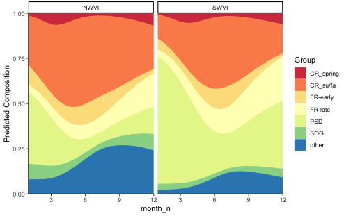
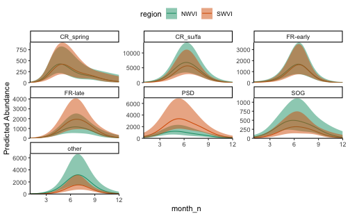

Spatially explicit, seasonal changes in stock composition and abundance can be estimated using `fit_stockseasonr()`. `fit_stockseasonr()` automatically generates the necessary data and parameter structures to pass to TMB, fits, the model, and returns parameter estimates and predictions.

We'll generate inputs for an integrated version of the model using two built-in datasets. The first is an example of composition data, which is a subsample of available genetic stock identification data from the west coast Vancouver Island commercial Chinook salmon fishery. `comp_ex` is a long dataframe where each row includes the number of samples within a sampling event (here a given day and sampling location) that correspond to each stock aggregate. These data are non-integer because they represent the sum, among individuals, of genetic stock assignment probabilities. Each sampling event is spatially and temporally explicit because it is assigned to a specific region, month, and year.

The second dataset is example catch and effort data from the same fishery. `catch_ex` is a long dataframe where each row represents the observed catch (individual pieces) for a given region, month, and year. Note that both datasets have the same spatio-temporal strata, which is necessary to fit integrated models.

We'll assume that both stock composition and abundance are influenced by season (month) and location (region). We'll also account for interannual variation with IID random intercepts. We can examine the model inputs that are generated by `fit_stockseasonr()` without fitting the actual model by setting `fit = FALSE`


```r
dat_in <- fit_stockseasonr(abund_formula = catch ~ 1 +
                             s(month_n, bs = "tp", k = 3, m = 2) +
                             region +
                             (1 | year),
                           abund_dat = catch_ex,
                           comp_formula = agg ~ 1 + region +
                             s(month_n, bs = "tp", k = 4, m = 2) +
                             (1 | year),
                           comp_dat = comp_ex,
                           model = "integrated",
                           fit = FALSE)
```

`fit_stockseasonr()` reshapes or 'widens' the composition data, then in-fills zero observations for a given group with small values (0.00001) to ensure model convergence. It next uses the `mgcv` and `sdmTMB` packages to create model matrices including seasonal smooths and random intercepts for years. The result is a list of five elements:

- `tmb_data` list of data inputs (observations, model matrices, new dataset for prediction, etc.) passed to the TMB model
- `tmb_pars` list of initial parameter values passed to the TMB model
- `tmb_map` 'mapped' parameters that are not estimated
- `tmb_map` parameters that are estimated as random effects within TMB
- `wide_comp_dat` a wide version of the input composition data that includes infilled values

Next we'll fit the model using `fit_stockseasonr()`, specifying the input composition data, catch data, and model type (`negbin`, `composition` or `integrated`) as above. This time we'll also include a new dataframe for which we would like to generate predictions. Note that the model may take several seconds to converge.


```r
new_dat <- expand.grid(
  month_n = seq(1, 12, by = 0.1),
  region = unique(comp_ex$region)
)

m1 <- fit_stockseasonr(abund_formula = catch ~ 1 +
                             s(month_n, bs = "tp", k = 3, m = 2) +
                             region +
                             (1 | year),
                           abund_dat = catch_ex,
                           comp_formula = agg ~ 1 + region +
                             s(month_n, bs = "tp", k = 4, m = 2) +
                             (1 | year),
                           comp_dat = comp_ex,
                           model = "integrated",
                       pred_dat = new_dat,
                           random_walk = TRUE,
                           fit = TRUE)
```

The object `m1` contains the model inputs described above, as well as a `TMB::sdreport()` object (named `sdr`), which includes parameter estimates for fixed effects.


```r
theta <- as.list(m1$sdr, "Estimate")

# abundance estimates for regional effects
theta$b1_j
#> [1]  8.19476069 -0.01017245
#composition fixed effect estimates
theta$B2_jk
#>            [,1]       [,2]       [,3]       [,4]        [,5]       [,6]
#> [1,]  2.4356276  0.8879957  0.7411992  1.3658515  1.33769655  0.3426505
#> [2,] -0.5197888 -0.3716419  0.1682162 -1.0971269  0.79557902 -0.7513375
#> [3,] -0.6756423 -1.4294631 -0.4154312 -1.1222731 -0.05767559 -0.3147967
#> [4,]  0.7934484  0.2896169  0.4433772  0.2192606 -0.29939192 -0.2501454
#> [5,] -0.6469329 -1.4777487 -0.1728590 -0.7231822 -0.58348745 -0.5168965
#>            [,7]
#> [1,] -0.0809810
#> [2,] -0.2055944
#> [3,]  1.0956856
#> [4,]  1.4179068
#> [5,]  0.8804047
```

The `summary(TMB::sdreport))` (named `ssdr`) includes model derived quantities, such as random effect estimates and integrated predictions (i.e. estimates of stock-specific abundance). Note that all predictions are provided in link space.


```r
ssdr <- m1$ssdr
unique(rownames(ssdr))
#>  [1] "b1_j"               "ln_phi"             "bs"                
#>  [4] "ln_smooth_sigma"    "ln_sigma_re1"       "B2_jk"             
#>  [7] "ln_sigma_re2"       "b_smooth"           "re1"               
#> [10] "re2"                "pred_mu1"           "pred_Mu2"          
#> [13] "logit_pred_Pi_prop" "log_pred_mu1_Pi"

# predicted total abundance
head(ssdr[rownames(ssdr) %in% "log_pred_mu1", ])
#>      Estimate Std. Error
# predicted stock composition estimates
head(ssdr[rownames(ssdr) %in% "logit_pred_Pi_prop", ])
#>                      Estimate Std. Error
#> logit_pred_Pi_prop -0.9688829  0.1623532
#> logit_pred_Pi_prop -0.9425117  0.1546164
#> logit_pred_Pi_prop -0.9165130  0.1474834
#> logit_pred_Pi_prop -0.8908812  0.1410395
#> logit_pred_Pi_prop -0.8656081  0.1353606
#> logit_pred_Pi_prop -0.8406821  0.1305078
# predicted stock specific abundance
head(ssdr[rownames(ssdr) %in% "log_pred_mu1_Pi", ])
#>                 Estimate Std. Error
#> log_pred_mu1_Pi 4.792131  0.4273834
#> log_pred_mu1_Pi 4.906351  0.4151351
#> log_pred_mu1_Pi 5.020153  0.4032914
#> log_pred_mu1_Pi 5.133525  0.3918798
#> log_pred_mu1_Pi 5.246449  0.3809274
#> log_pred_mu1_Pi 5.358902  0.3704604
```

stockseasonr includes built-in plotting functions as example visualizations for predictions. For example, predictions of seasonal trends in mean stock composition can be visualized with `plot_stacked_comp()`.


```r
plot_stacked_comp(x_var = "month_n", grouping_var = "agg", 
                  facet_var = "region", ssdr = m1$ssdr, comp_dat = comp_ex,
                  pred_dat = new_dat)
```



Estimates of stock-specific abundance can be used with the same inputs and `plot_ribbon_abund()`.


```r
plot_ribbon_abund(x_var = "month_n", grouping_var = "agg", 
                 colour_var = "region", ssdr = m1$ssdr, comp_dat = comp_ex,
                 pred_dat = new_dat)
```



